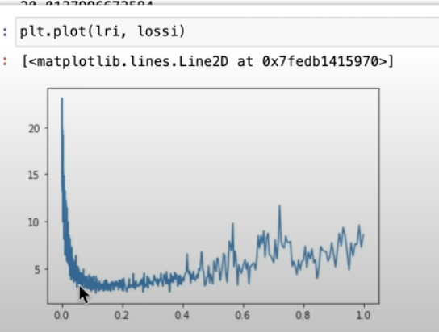
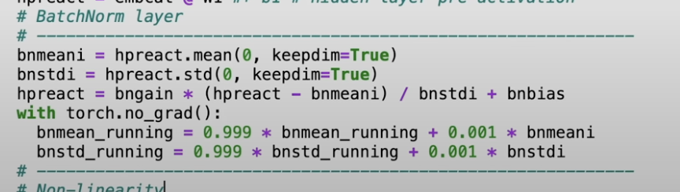

# Lesson 1


# Lesson 2

### Notes
* Smoothing used in bigram/trigam model by adding 1 to all counts to make model more general (prevents overfitting to current data set)
* Regularization some effect as Smoothing by achieved in different way, instead of editing data before training (sometimes can't be done in case of NN) we add to loss function something like `normal_cost_fn()+0.01*(W**2).mean()`
Thus we penalize to big weights which may lead to overfitting.
* Cost function to calculate models based on probability:
  * If the model assigns higher probabilities then it means, that it better knows the world, because he is confident in his moves. So in this can we can assign cost function as product of probabilities on given data set.
    * Example: `p(first_char, second_char) => probability that after first_char the next will be second_char` then we just iterative with function like this over data set and multiple probabilities.
    * However multiplying so many numbers (which are less then <0,1>) would let to very small number. Thus we `log` function to turn it into more friendly numbers, and from the property of log we can use sum instead of product. Because `log(a * b) = log(a) + log(b)`. And because log(<0,1>) < 0 we negate it
    * Name: `Maximum likelihood`
  * Implementation of maximum likelihood is named  `cross_entropy` is actually better because it also check if the high probability points to a proper class. `cross_entropy = -sum(y_actual[class] * log(y_pred[class]) for class in class_set)` `y_actual[class]` this will be =1 only for one class - there is torch function for this

### Tasks
* E02: split up the dataset randomly into 80% train set, 10% dev set, 10% test set. Train the bigram and trigram models only on the training set. Evaluate them on dev and test splits. What can you see?
  * For bigrams cost function almost doesn't change => it (may) means that model is generic and it doesn't overfitting on particular data set
  * For trigrams cost function increases (2.0 -> 2.5) it (may) means that trigram models are more complicated thus easier overfitting

* E03: use the dev set to tune the strength of smoothing (or regularization) for the trigram model - i.e. try many possibilities and see which one works best based on the dev set loss.
  What patterns can you see in the train and dev set loss as you tune this strength? 
  Take the best setting of the smoothing and evaluate on the test set once and at the end. => 
  How good of a loss do you achieve?
  * When we increase the strength of smoothing (or regularization) the model because more generic thus `cost(training) - cost(dev)` decreases, but in this case overall cost(training) also increases significantly, so it makes it NOT worth it.

# Lesson 3
* Intuition for NN:
```python
In [5]: W = torch.randn((2,8))
In [6]: print(W)
tensor([[ 1.8473, -0.3030, -0.0453, -1.1201,  1.4875,  0.9364,  0.0311,  0.1718], <<-- number of neurons
        [-0.0759,  1.0645,  1.3289,  0.7033,  1.8630,  0.9432, -0.5734,  1.0026]]) 
           ^
           |
  number of weights in neuron
In [8]: W.size()
Out[8]: torch.Size([2, 8]) => 8 neurons every neuron has 2 weights/inputs
```
* Embedding - on alphabet example in some text. Let's take all letters of alphabet -> 27. And let's represent how each one relate to other, but instead of creating matrix of $27^{27}$ and as value store probability of one world after another, lets create a matrix of size (27,2) 27 - all letters and 2 is vector [x,y] which should **embed** some how world and its relation in this vector (?? two embeds with vectors close to each other are similar??)
* Minibatches - we pick in every iteration of forward and backward pass new mini data set from training data set and evaluate on them. It is better because: "It is better to do **many** gradients which don't take in account all data (so are less precise). Then take **fewer** steps of more **precise** gradient."
* How to find a good learning rate $\alpha$. First do some binary search between 0.00001 -> 1000 by finding. When you find bold boundaries (where) like 1 -> 0.001. Generate all values between: `10 ** torch.linspace(-3,0,1000)` and record stats by training and then just plot them.. At the end of training we lower learning rate and do some more training with lower learning rate.
* Hyperparameter - constant like parameters used for neural net. For example size of embedding vector. Number of neurons
* Data split:
  * 80% training - forward and backward pass
  * 10% dev - for tunning hyper parameters
  * 10% test - for end testing model
* Indexing by other vector:
    ```python
    C = [
      [1,2,3],
      [4,5,6]
    ]
    INDEX= [1,0,1]
    C[INDEX] => [[4,5,6],[1,2,3],[4,5,6]] # we just select by index
    # for multi dimensions we select multiple also by indexing and just group them in vectors so
    INDEX = [[0,1],[1,0]]
    C[INDEX] => [[ [1,2,3], [4,5,6] ], [ [4,5,6], [1,2,3] ]]

    ```

# Lesson 4
* Good initialization data
  * We can obtain some reference good initial cost value (sometimes). For example for task to predict next world, the initial cost should be when model predict every letter with same probability 1/27
  * To obtain such cost value on the pre-optimized model, we can modify initial random values of weight for example by multiplying it by some small number like `0.001`
* dead neurons 
  * for example when we have tanh layer with neourns and neuron is always in flat region of tanh(tails) thus outputs only 1 or -1, grad(tanh) then is equal to zero 0 thus it starts killing grad from other layers. Event if it is not tottaly dead, you can effect learning process too
* batch normalization
  * we like when input to next layer has gaussian distribution on weights
    * It gives good entry properties for functions like tanh for example
  * it is trivially to achieve this just by normalizing output (because normalizing operation can be backpropagated as normal layer)
  * however we don't won't to stick too much to gaussian curve, because in next iteration it can differ that is why we add global bias(`bnbias`) and global multiplier(`bngain`) 
  * 
  * we also calculate aggregated through batches `bnmean_running` and `bnstd_running`, to use it later for prediction. (THEY ARE NOT LEARNED)
  * When we are using batch-normalization there is no sense in using bias for the previous layer, because we are cancelling it and adding global batch normalization bias
  * side effect of using batch normalization is some kind of random noise between next iterations because of the global `bnbias` and `bngain`
* we should also initialize weights in some manner to have gaussian distribution at start